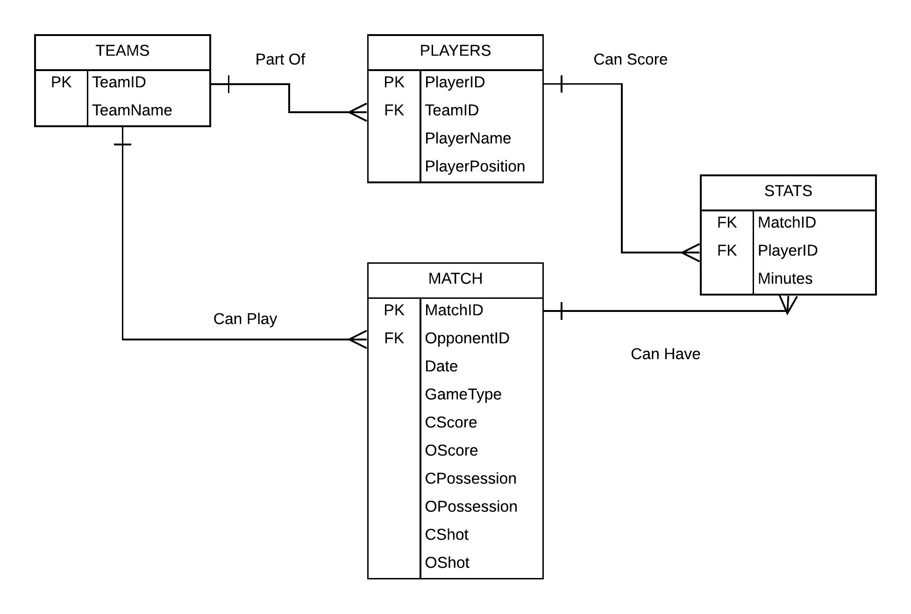
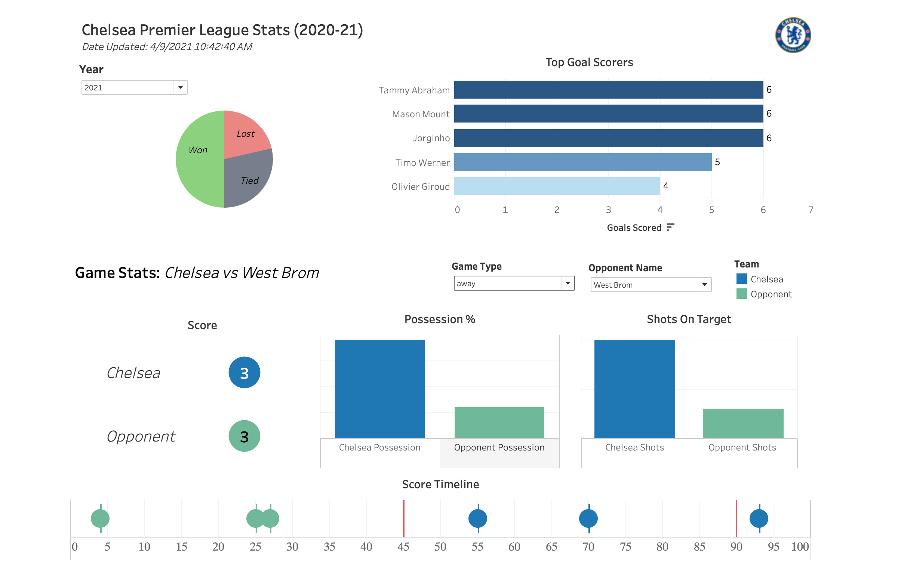

# PREMIER LEAGUE ANALYSIS

## AIM

Scrape https://www.premierleague.com and periodically collect results and stats for past and current games played by Chelsea and visualize them using Tableau Dashboard.

## DATABASE SCHEMA

The data is generated and updated regularly by scraping the premier league website. Below is the schema of data.

## FIELD INFORMATION

### TEAMS

1. TeamID (int): Primary key to uniquely identify each team
2. TeamName (string): Name of all the teams in EPL

### PLAYERS

1. PlayerID (int): Primary key to uniquely identify each player
2. TeamID (int): Foreign key that refers teams data to uniquely identify each team
3. PlayerName(string): Full name of the player
4. PlayerPosition(string): Position the player plays at

### MATCH

1. MatchID (int): Primary key to uniquely identify each match
2. OpponentID(int): Foreign key that refers teams data to uniquely identify each team
3. Date (string): mm/dd/yyyy format date of the match
4. GameType(string): Whether the game was away or home for Chelsea
5. CScore(int): Goals scored by Chelsea
6. OScore(int): Goals scored by opponent team
7. CPossession(float): Possession % by Chelsea for the game
8. OPossession(float): Possession % by opponent team for the game
9. CShot(int): Shots on target by Chelsea
10. CShot(int): Shots on target by opponent team

## SCRAPING & CLEANING

1. Used FireFox headless browser and Selenium to scrape premier league website. The elements to be extracted were identified using their tags, xpath, class names, appropriate sleep was included in the script to make sure all the required details are loaded and captured properly.

2. Filtered extra data extracted such as converting goal minutes into integer values by removing ' behind the number, converted extra time i.e 90 + 3 into proper format i.e 93, stripped unnecessary information and retrieved player name.

3. Categorized the scrapped data into players.csv for player information, match.csv for match information and stats.csv for match stats. In addition, the script is designed to generate unique ids for each player, match and stats previous and future both which can act as primary keys and foreign keys.

More details about the scrapping process can be found in [scrapper.py](utils/scrapper.py) file in the utils directory.

## VISUALIZATION

1. The script runs on 8pm every Wednesday, Saturday, Sunday using Crontab so that the data is always updated and so is the visualization.

2. The Dashboard is created in Tableau and displays game stats for each team Chelsea has faced for the year 2020-21. It also shows Chelsea's top players and win,loss,tie count. Their win count has apparently improved since hiring new manager in 2021.

The dashboard can be accessed on Tableau Public or can be downloaded from the dashboard folder. Below is the screenshot of the dashboard.

## TECHNOLOGIES USED

1. Scraping: Selenium
2. Programing & Data manipulation: Python and Pandas
3. Visualization: Tableau
4. Scheduling: Crontab

